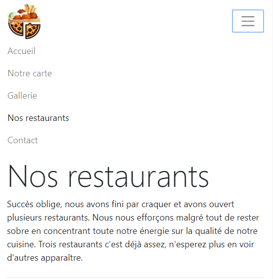

bootstrap-resto-website
=================================

Project of [Ismail Joseph](https://github.com/Fesouille)
----------------------------------

*Exercice realized from the 18 february 2019 to 21 february 2019, as a project for the formation [BeCode](https://www.becode.org/) to be a Web Developper*

* Project:
For this project, I have to create the website for the restaurant of my choice (fictional). The main constraints are to use bootstrap, to make the website fully responsive for smartphones, tablets and desktop screens.
I have to create at least 5 html pages, one for each section of the website.
 
As a challenge, I tried to have a score of at least 80% for the PWA from the Google Lighthouse audit, but couldn't reach it. I managed to get only 64% unfortunately. But I don't give my last word!

* Content:
	* 5 HTML files: for for each section of the website i.e. Intro, menu, opening hours, pictures and contact form.

	* CSS file: handles the style of the html files.

	* CDN: to access bootstrap library.

	* Javascript file: this file contains manly two functions
		* Function to ask the name of the user and include it in the intro text
		* Function to generate the restaurants opening hours and the current date and time, and then checks if the restaurants are open given the date and time.

* Check it out! :
	* [My first restaurant webpage]("https://fesouille.github.io/bootstrap-resto-website/")

* A few illustrating pictures:

* Progress: 
	* 18 february 2019: project beginning.
	* 21 february 2019: project end.