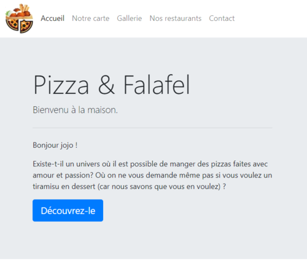
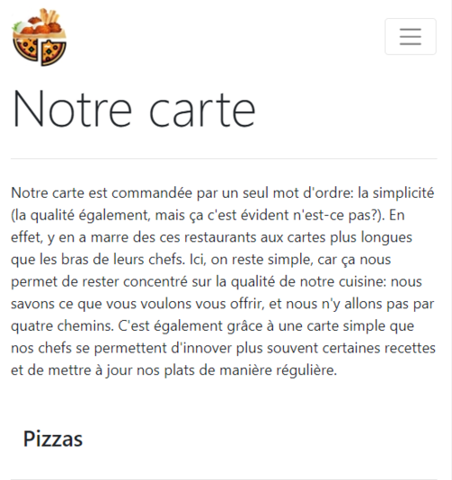

Progressive enhancement
=================================

Project of [Ismail Joseph](https://github.com/Fesouille).
----------------------------------

*Exercice realized from the 18 february 2019 to 21 february 2019, as a project for the formation [BeCode](https://www.becode.org/) to be a Web Developper*

* Project:
For this project, we have to realize a game based on the famous [Cookie Clicker](http://orteil.dashnet.org/cookieclicker/). As our first game, we don't have to make it 100% similar, but we have a list of given functionalities to create (such as 'the multiplier', 'the autoclicker', 'the bonus'). In order to achieve this project in group, we made use of [Trello](https://trello.com/) as our Kanban tool.

* Content:
	* HTML file: contains the head, body, and links to javascript and css files.

	* CSS file: handles the style of the different functionalities and the body.

	* Javascript file: this file contains all functionalities of the game i.e. the button, their actions, ...

* Check it ou! :
	* [My first restaurant webpage]("https://fesouille.github.io/progressive-enhancement2/")

* A few illustrating pictures:

* Progress: 
	* 18 february 2019: project beginning.
	* 21 february 2019: project end.